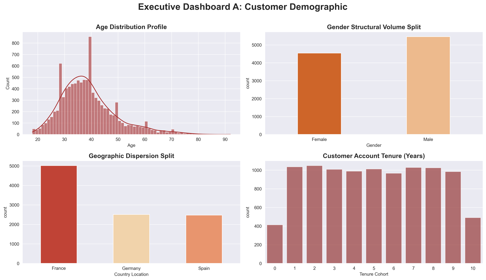
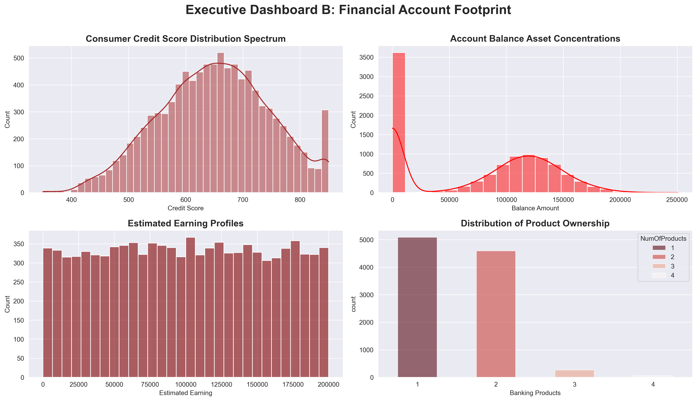
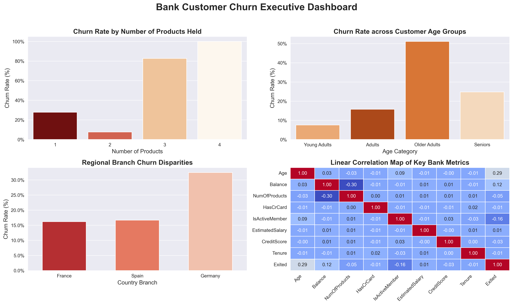

# 🏦 End-to-End Bank Customer Attrition Analysis & Predictive Modelling


## 📌 Executive Summary
Customer attrition poses a significant financial threat to retail banking operations, as acquiring a new customer costs up to 5x more than retaining an existing one. This project analyzes a dataset of 10,000 retail bank accounts to uncover key demographic and behavioral drivers of churn, statistically validates retention factors, and deploys a Machine Learning classification model to flag high-risk accounts prior to account closure.

## 🎯 Key Business Questions & Findings

1. **Which demographic segments show the highest customer leakage?**
   * **Regional Risk:** Accounts in the **German branch** exhibit a **32.44% churn rate**—double the attrition rates observed in France (16.15%) and Spain (16.67%).
   * **Age Vulnerability:** **Older Adults (Ages 45–60)** account for the highest demographic exit rate at **51.12%**.

2. **What product and channel behaviors correlate with account closures?**
   * **Product Friction:** Multi-product bundling reveals extreme friction—customers holding **3 or 4 products** face an alarming **82.71% to 100% churn rate**.
   * **Platform Engagement:** Platform activity acts as a major retention anchor—inactive members exit at nearly double the rate of active members (**26.85% vs. 14.27%**).

## 📈 Executive Dashboards & Exploratory Analysis

### 1. Customer Demographic Overview
Analyzing baseline distribution across age, gender, geographic location, and account tenure.


### 2. Financial Account Footprint
Examining balance distributions, credit scores, estimated earnings, and product holdings.


### 3. Executive Customer Churn Analysis
Synthesizing behavioral patterns directly impacting attrition rates.


## 🔬 Statistical Hypothesis Testing (Chi-Square)

To rigorously validate whether observed behavioral patterns were statistically significant drivers or merely random background noise, Chi-Square Tests of Independence ($\alpha = 0.05$) were conducted:

| Behavioral Variable | Hypothesis Test | $p$-value | Decision | Business Takeaway |
| :--- | :--- | :--- | :--- | :--- |
| **IsActiveMember** | $H_0$: Active status is independent of Churn | **`0.000000`** | **Reject $H_0$** | Highly significant driver; digital portal engagement directly anchors customer retention. |
| **HasCrCard** | $H_0$: Credit Card ownership is independent of Churn | **`0.492372`** | **Fail to Reject $H_0$** | No statistical relationship; issuing credit cards does not alter retention probability. |

## 🤖 Predictive Machine Learning Model

A **Random Forest Classifier** was trained on an 80/20 train-test split (with depth constraints to mitigate overfitting) to predict individual customer churn risk:

* **Overall Model Accuracy:** `86.05%`
* **Precision (Class 1 - Churn):** `78%`
* **Recall (Class 1 - Churn):** `40%`

### Strategic Trade-off:
The model prioritizes **High Precision (78%)**. This ensures that automated alerts sent to retention managers are highly trustworthy, preventing the bank from wasting marketing budgets or offering unnecessary discounts on low-risk accounts.

## 💡 Strategic Recommendations for Bank Leadership

1. **Targeted Digital Re-engagement:** Deploy automated email/push notifications for account holders after 30 days of portal inactivity to boost active membership.
2. **Product Bundle Restructuring:** Audit customer accounts holding 3+ products to resolve fee friction or product complexity triggering exit decisions.
3. **Regional Audit (Germany Branch):** Launch an operational review on customer service quality and local market competition in Germany to reduce the high 32.44% regional churn rate.

## 📁 Repository Structure

```text
├── TDI_Capstone/
│   ├── data/                 # Raw and cleaned dataset files
│   ├── notebooks/            # Jupyter Notebooks (EDA, Statistical Tests, ML)
│   └── reports/              # Exported dashboard graphics & visual assets
├── .gitignore                # Rules for excluded files/folders
├── README.md                 # Executive summary & project documentation
└── requirements.txt          # Required Python dependencies
```

## ⚙️ How to Run This Project

1. Clone the repository:
   ```bash
   git clone https://github.com/NeuralPhi/TDI_Learn_Python.git
   cd TDI_Learn_Python
   ```

2. pip install -r requirements.txt

3. Launch Jupyter Notebook or VS Code to run the analysis scripts inside the notebooks/ directory.
