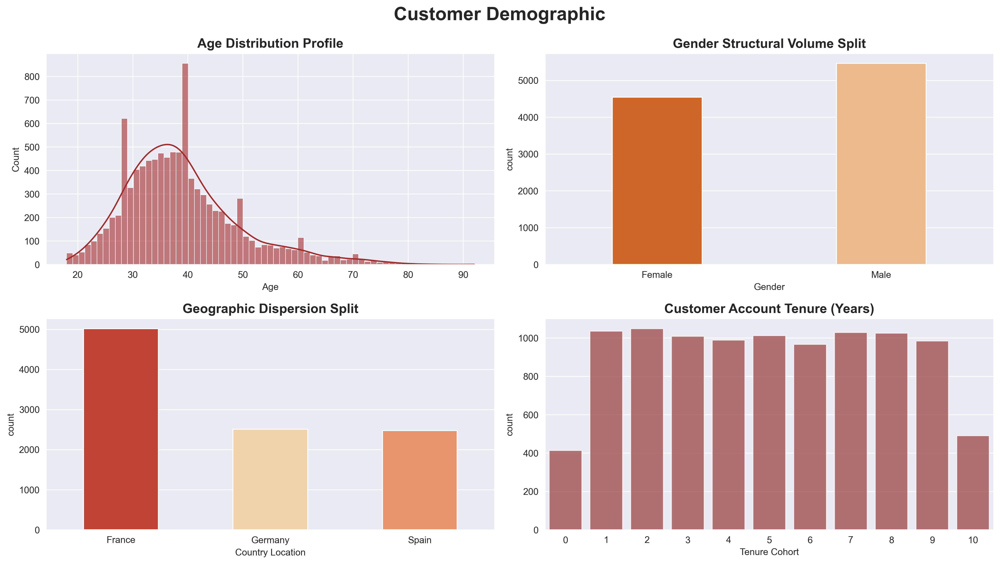
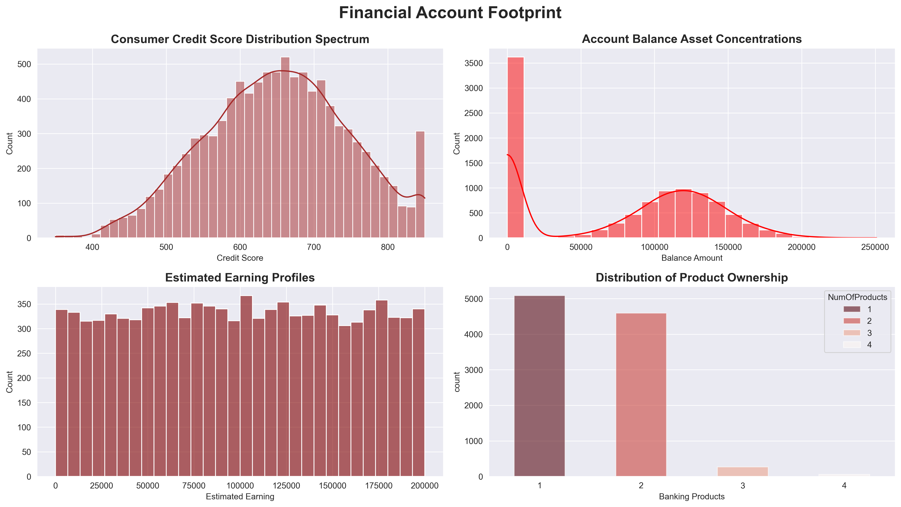
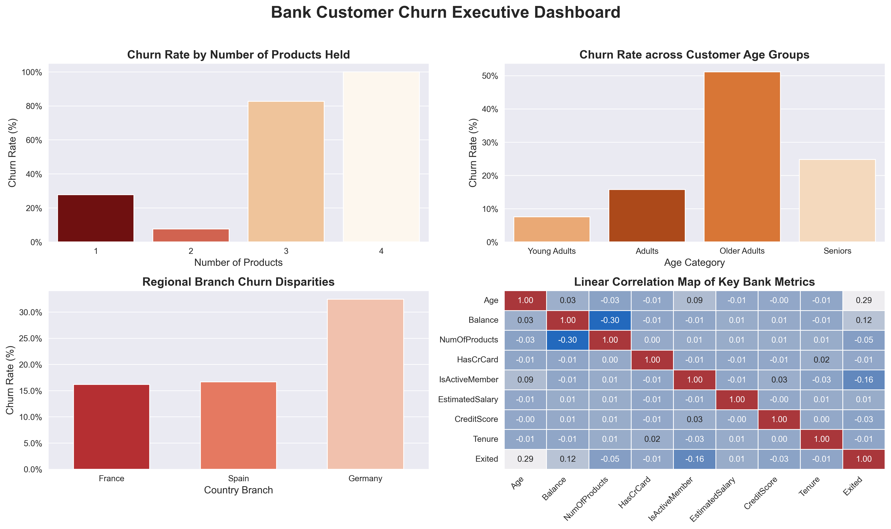

# 🏦 End-to-End Bank Customer Attrition Analysis & Predictive Modelling


## 📌 Executive Summary
Customer attrition poses a significant financial threat to banking operations, as acquiring a new customer costs up to 5x more than retaining an existing one. Analyzing a dataset of 10,000 bank accounts, this project identifies key demographic and behavioural churn drivers through exploratory analysis and statistical validation. Using these insights, a Random Forest classification model was built to flag high-risk accounts before closure, enabling targeted, proactive retention strategies.

## 🎯 Key Business Questions & Findings

1. **Which demographic segments show the highest customer leakage?**
   * **Regional Risk:** Accounts in the **German branch** exhibit a **32.44% churn rate**— nearly double the attrition rates observed in France (16.15%) and Spain (16.67%).
   * **Age Vulnerability:** **Older Adults** account for the highest demographic exit rate at **51.12%**.

2. **What product and channel behaviours correlate with account closures?**
   * **Product Friction:** Multi-product bundling reveals extreme friction. Customers holding **3 or 4 products** face an alarming **82.71% to 100% churn rate**.
   * **Account Engagement:** Customer activity acts as a major retention anchor. Inactive members exit at nearly double the rate of active members (26.85% vs. 14.27%).

## 📈 Dashboards & Visualizations

<details>
<summary><b>Click to expand Phase 1: Univariate Baseline Analysis (Data Distributions)</b></summary>

<br>

> *Establishes the standalone shape, spread, and volume split for every individual variable across the dataset to set the baseline for downstream churn analysis.*

#### 1. Customer Demographic Overview
* **Focus:** Age distribution curve, gender volume split, geographic dispersion, and tenure cohorts.



#### 2. Financial Account Footprint
* **Focus:** Credit score distribution, account balance asset concentrations, estimated earnings, and product holdings.



</details>

### Phase 2: Executive Churn Drivers (Bivariate & Correlation Analysis)

> *Cross-references features against customer attrition to isolate key risk drivers*

#### 3. Executive Customer Churn Analysis
* **Strategic Value:** Synthesizes multi-variable interactions into actionable executive insights to guide retention strategy.



## 🔬 Statistical Hypothesis Testing (Chi-Square)

To rigorously validate whether observed behavioural patterns were statistically significant drivers or merely random background noise, Chi-Square Tests of Independence ($\alpha = 0.05$) were conducted:

| Behavioural Variable | Hypothesis Test | $p$-value | Decision | Business Takeaway |
| :--- | :--- | :--- | :--- | :--- |
| **IsActiveMember** | $H_0$: Active status is independent of Churn | **`<0.000001`** | **Reject $H_0$** | Highly significant driver; Maintaining an 'Active Member' status  directly anchors customer retention. |
| **HasCrCard** | $H_0$: Credit Card ownership is independent of Churn | **`=0.492372`** | **Fail to Reject $H_0$** | No statistical relationship; issuing credit cards does not alter retention probability. |

## 🤖 Predictive Machine Learning Model

A **Random Forest Classifier** was trained on an 80/20 train-test split (with depth constraints to mitigate overfitting) to predict individual customer churn risk:

* **Overall Model Accuracy:** `86.05%`
* **Precision (Class 1 - Churn):** `78%`
* **Recall (Class 1 - Churn):** `40%`

### Trade-off (Precision over Recall):
The model prioritizes high Precision (78%) over broad Recall (40%). This design choice ensures that automated retention alerts are highly trustworthy, preventing the bank from wasting intervention budgets on low-risk accounts—accepting lower overall churn detection in exchange for minimal false alarms.

## 💡 Strategic Recommendations

1. **Pivot Strategy Toward Active Engagement:** Allocate capital toward retention programs that incentivize recurring account interaction and sustain long-term activity.
2. **Product Bundle Restructuring:** Halt automated cross-sell campaigns targeting two-product holders. Audit customer accounts holding 3+ products to resolve friction or bottlenecks triggering exit decisions.
3. **Regional Audit (Germany Branch):** Launch an operational review on customer service quality and local market competition in Germany to reduce the high 32.44% regional churn rate.
4. **Deploy Older Adult Engagement:** Design specialized wealth-preservation perks for the 46–60 age bracket (51.12% baseline churn), prioritizing active account status to anchor long-term savings.


## 📁 Repository Structure

```text
bank_customer_churn_analysis/
├── data/                  # Raw and cleaned dataset files
├── docs/                  # Supporting project documentation
├── notebooks/             # Jupyter Notebooks (EDA, Statistical Tests, ML)
├── reports/               # Visual assets & executive dashboards
├── .gitignore             # Rules for excluded files/folders
├── README.md              # Executive summary & project documentation
└── requirements.txt       # Required Python dependencies
```

## ⚙️ How to Run This Project

1. Clone the repository:
   ```bash
   git clone https://github.com/NeuralPhi/bank_customer_churn_analysis.git
   cd bank_customer_churn_analysis
   ```

2. python -m pip install -r requirements.txt

3. Launch VS Code or Jupyter Notebook to run the analysis scripts inside the notebooks/ directory.

## 📖 Deep Dive & Connect

* **Full Article:** For an in-depth breakdown of the business narrative, strategic insights, and methodology, read the full publication on **[Medium](https://medium.com/@opadojajoshua/bank-customer-churn-analysis-c6573b42f61f)**.
* **Let's Connect:** Follow or reach out on **[LinkedIn](https://www.linkedin.com/in/joshua-opadoja/)** and **[X](https://x.com/JDataCraft)**.

⭐ **If you found this project useful or insightful, consider giving this repository a star!**